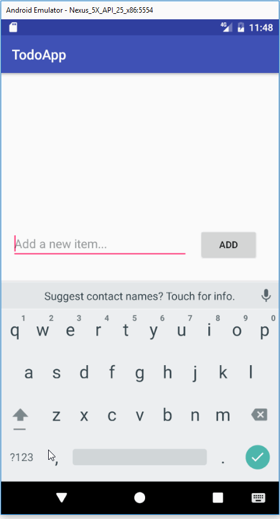

Todo-app

This is an Android app for CodePath pre-work. This app allows you to create a simple to-do list.

With this app, you can:
* [x] Add and remove items
* [x] Edit items
* [x] Persist items and retrieve them on app restart

Check out this walkthrough:

GIF created using [LiceCap](http://www.cockos.com/licecap/).
